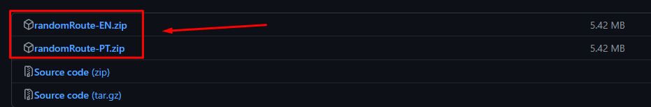
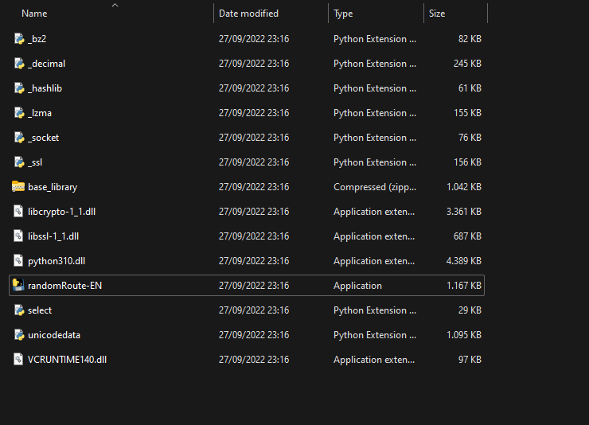

# random-flightRoute
Just a sorter of routes from a list of airports provided by the user.

You can choose between English or Portuguese version:
"randomRoute-"language".exe

Download link:
https://github.com/lucasprad05/random-flightRoute/releases/tag/v1.0

- Choose the English or Portuguese zip
- Extract the zip file
- Open the folder and search for "randomRoute-EN.exe" or "randomRoute-PT.exe"
- Execute and have fun :)

<h1>Instructions</h1>

Type an ICAO airport and when you're done, press "e" to exit the program.
It'll sugest for you a route and if you didn't like, press "y" to sort again.

<h1>Code</h1>
You can access the code in Python :)
Feel free to upgrade with more ideas...
